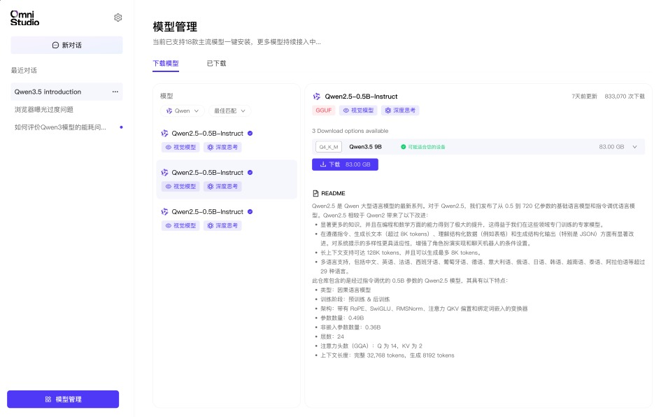
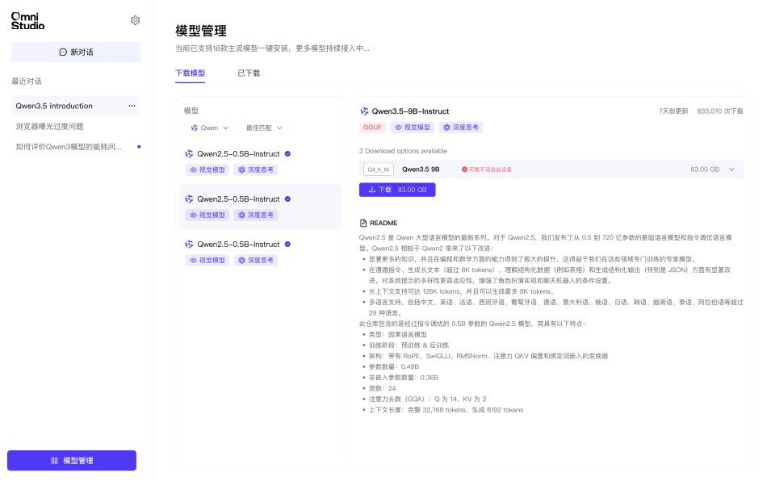
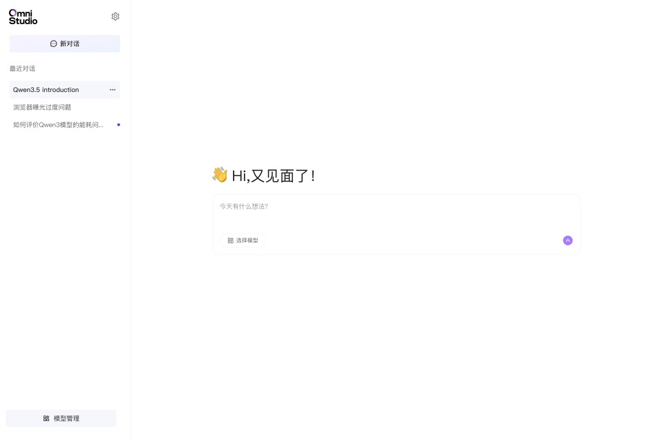
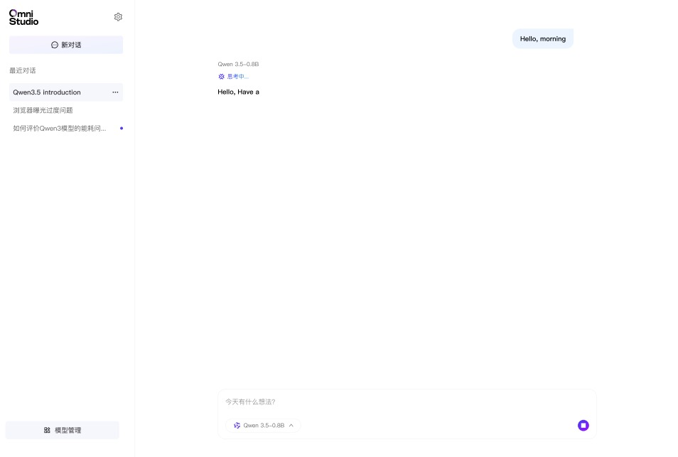

# 聊天使用

## 创建新对话

点击侧边栏顶部的“新对话”按钮即可创建新的聊天会话。新会话默认使用当前已加载模型；如果当前没有加载模型，系统会先提示你选择模型。

新对话创建后，主页面会显示欢迎页，等待输入第一条消息。

## 查看和切换最近对话

最近对话会按时间倒序展示在侧边栏中。点击任意会话即可切换，之前的消息上下文会被完整保留。

## 在聊天中切换模型

点击顶部导航栏的模型名称，可以在当前会话上下文中切换已安装模型。切换时系统会自动完成卸载旧模型、加载新模型的过程。

## 输入和发送消息

你可以在底部输入框中直接输入问题或指令：

- `Enter`：发送消息
- `Shift + Enter`：输入换行
- 点击发送按钮：提交当前内容

发送后，模型会立即开始推理，并以流式方式逐步输出回复内容。

## 中断生成

模型生成过程中，页面会显示“思考中...”动画，此时可点击停止按钮中断当前生成。已经输出的部分会保留在对话中。

## 阅读响应元数据

每条模型回复下方都会显示推理指标：

- **tps（tokens per second）**：生成速度
- **Tokens**：本次生成的 token 总数
- **耗时**：整次推理所花费时间

这些信息适合做性能对比，也适合在文档站中作为“指标说明”栏目引用。
这些信息可以帮助你判断当前模型的生成速度、输出规模和整体耗时。
