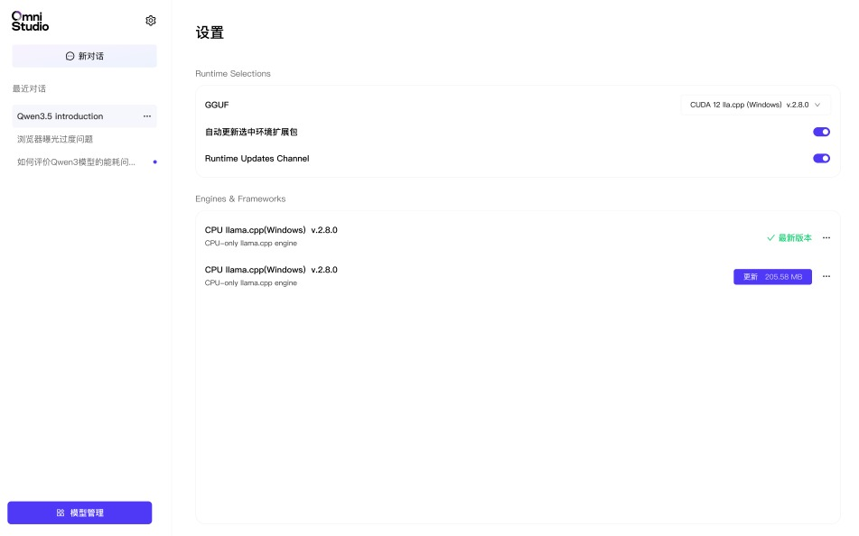

# 模型总览

OmniStudio 通过 OmniInfer Gateway 提供统一的模型发现、加载和切换能力。

## 支持的模型类型

| 模型类型 | 说明 | 示例 |
|----------|------|------|
| **LLM** | 面向纯文本生成和对话 | Qwen、LLaMA、Mistral |
| **VLM** | 支持图文多模态输入 | Qwen-VL、LLaVA |
| **World Model** | 具备理解与模拟能力 | 开发中 |

## 可下载模型页面

OmniStudio 内置模型市场，当前支持多款主流模型一键安装。模型卡片通常包含以下信息：

- 模型名称和参数规模
- 特性标签，例如“推荐”“视觉”
- 一键安装入口

## 模型管理价值

把模型能力集中在一个管理界面中，有几个好处：

- 降低用户手动处理模型文件的成本
- 让下载、安装、切换动作保持一致
- 让已安装模型和可下载模型更容易管理
