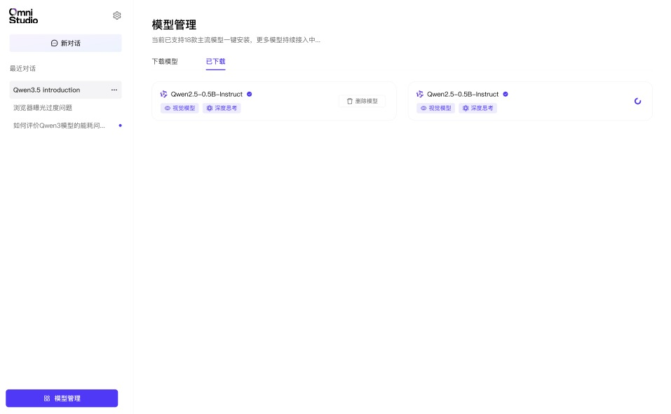

# 下载管理与存储

## 暂停、恢复与重试

模型下载过程中通常可以使用以下操作：

- **暂停**：暂时中断当前下载任务
- **恢复**：从断点继续下载，无需重新开始
- **重试**：下载失败后重新发起请求，已下载部分可继续复用

## 下载状态

| 状态 | 页面表现 | 说明 |
|------|----------|------|
| **等待中** | 排队图标 | 下载任务已创建，等待开始 |
| **下载中** | 进度条与百分比 | 正在传输模型文件 |
| **暂停** | 暂停图标 | 用户手动暂停 |
| **完成** | 已安装标记 | 模型可立即加载 |
| **失败** | 错误提示与重试按钮 | 下载失败，可再次尝试 |

## 存储与磁盘占用

| 模型规模 | `Q4_K_M` 大小 | `Q8_0` 大小 | `F16` 大小 |
|----------|---------------|-------------|------------|
| 1B - 3B | 0.5 - 2 GB | 1 - 3 GB | 2 - 6 GB |
| 7B - 8B | 4 - 5 GB | 7 - 8 GB | 14 - 16 GB |
| 13B - 14B | 7 - 8 GB | 13 - 14 GB | 26 - 28 GB |
| 70B | 38 - 40 GB | 66 - 70 GB | 130+ GB |

下载或安装大模型前，建议先预留足够磁盘空间，并定期清理不再使用的模型。

## 已安装模型

“已安装模型”页面通常会显示：

- 模型名称
- 参数规模
- 文件大小
- 删除入口
