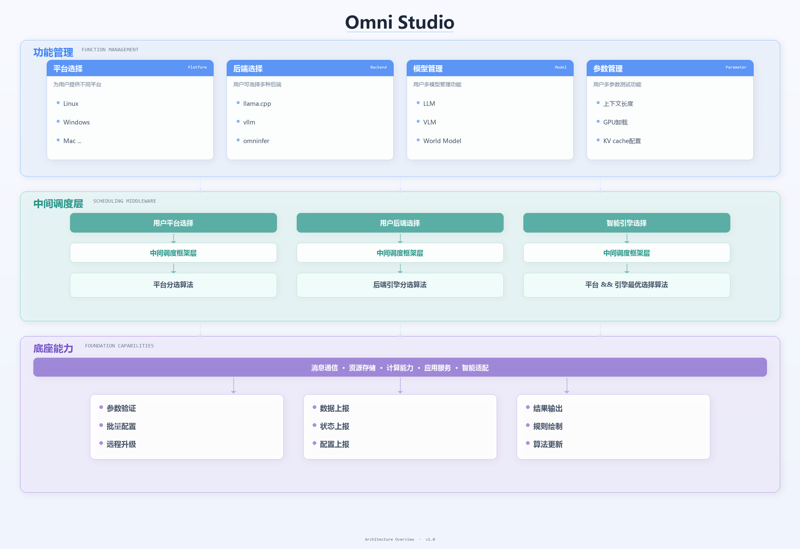
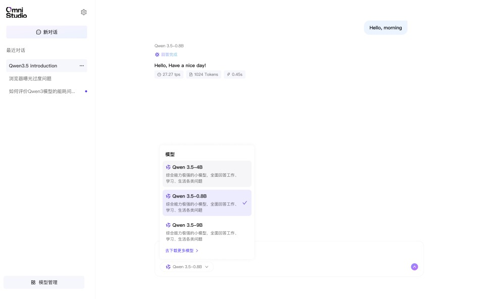

# 界面与 UI

## 整体布局

OmniStudio 使用三层架构界面设计，方便把平台管理、调度能力与推理底座分层呈现。

- **顶部：功能管理层**，用于平台选择、后端选择、模型管理和参数配置。
- **中部：中间调度层**，负责平台分选、后端分选和全局最优调度。
- **底部：底座能力层（OmniInfer）**，承载核心推理、配置管理和输出优化能力。

## 侧边栏

侧边栏位于页面左侧，是左侧目录式使用体验的核心区域，主要承担以下职责：

- **新对话**：快速创建新的聊天会话。
- **最近对话**：按时间倒序展示历史对话，点击即可切换。
- **模型管理入口**：跳转到模型下载和安装管理页面。
- **当前模型指示**：在侧边栏底部显示当前加载模型与状态。

## 输入区

提示词编辑器位于聊天区底部，主要包含：

- **文本输入框**：支持多行输入。
- **发送按钮**：提交当前输入内容。
- **模型选择器**：在当前聊天会话中快速切换模型。

常用快捷方式：

- `Enter`：发送消息
- `Shift + Enter`：换行

## 聊天主区域

聊天主区域位于页面中心，是用户停留时间最长的部分：

- **消息气泡**：用户消息与模型回复交替呈现。
- **流式输出**：模型生成时逐字渲染，并显示“思考中...”状态。
- **响应元数据**：在每条回复下方展示 `tps`、`Tokens`、总耗时等性能指标。
