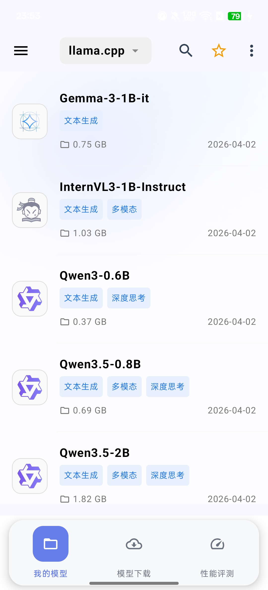
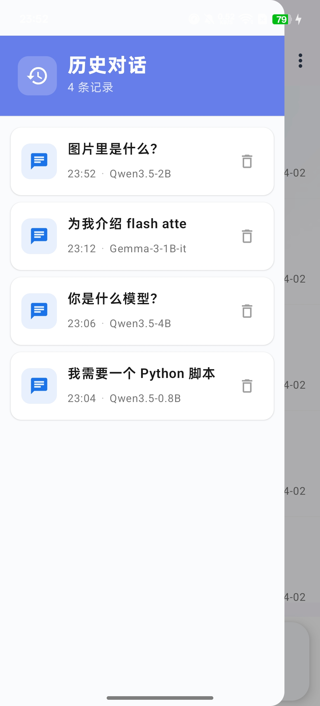

# 界面与导航

## 整体布局

OmniChat 采用底部导航栏设计，分为三个主要页面：

- **我的模型**：管理已下载的本地模型，选择后端进入对话。
- **模型下载**：浏览和下载在线模型目录。
- **性能评测**：对已下载模型进行推理速度基准测试。

## 我的模型

顶部下拉菜单用于切换推理后端（如 `llama.cpp`、`MNN`），列表会自动过滤并只显示该后端支持的已下载模型。

每个模型条目显示：
- 模型家族图标
- 模型名称与大小
- 能力标签（文本生成、多模态、深度思考等）
- 下载日期

长按模型条目可弹出操作菜单，支持查看模型详情或删除模型。

## 模型下载

顶部下拉菜单可按后端筛选（`llama.cpp`、`MNN` 等）。标签栏支持按能力过滤，例如"多模态"、"深度思考"、"音频理解"。

每个模型卡片显示后端标签、能力标签和存储大小。已下载的模型显示"对话"按钮，未下载的显示"下载"按钮。

## 历史对话

从左侧滑入或点击菜单图标可打开历史对话抽屉。每条记录显示：

- 对话标题
- 时间
- 所用模型名称

点击任意记录可继续该对话，右侧垃圾桶图标用于删除。
