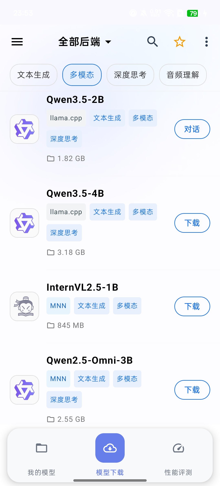

# 下载与管理

## 下载模型

1. 点击底部导航栏的"模型下载"。
2. 通过顶部下拉菜单选择后端（`llama.cpp` 或 `MNN`）。
3. 可使用标签筛选所需能力（多模态、深度思考等）。
4. 找到目标模型后点击"下载"按钮，下载在后台进行，退出应用也不会中断。
5. 下载完成后，模型自动出现在"我的模型"列表中。

## 选择合适的模型

手机推荐选择 6GB 以下的模型。以下是常见选择：

| 模型 | 大小 | 后端 | 特点 |
|------|------|------|------|
| Qwen3-0.6B | 0.37 GB | llama.cpp | 最轻量，适合入门 |
| Qwen3.5-0.8B | 0.69 GB | llama.cpp | 支持视觉与深度思考 |
| Qwen3.5-2B | 1.82 GB | llama.cpp | 综合能力较强 |
| InternVL2.5-1B | 845 MB | MNN | MNN 后端视觉模型 |

## 管理已下载模型

在"我的模型"页面，顶部下拉菜单可切换后端，只显示该后端对应的模型。

长按模型可：
- **查看模型信息**：显示完整的元数据（格式、运行时、能力等）。
- **删除模型**：从设备上移除模型文件，释放存储空间。
