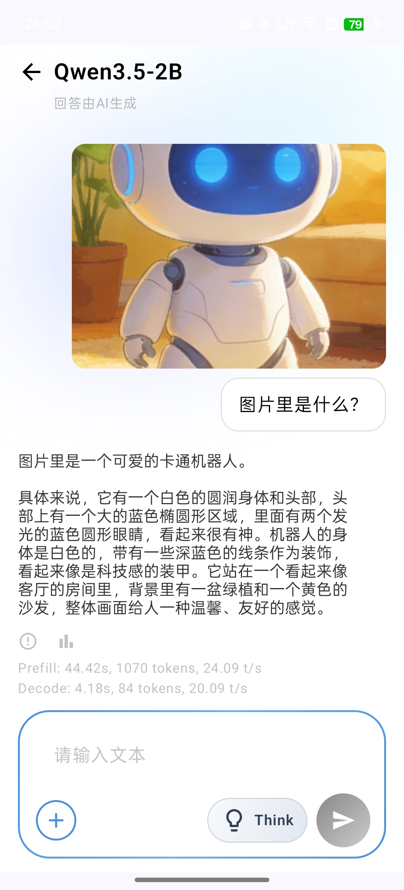
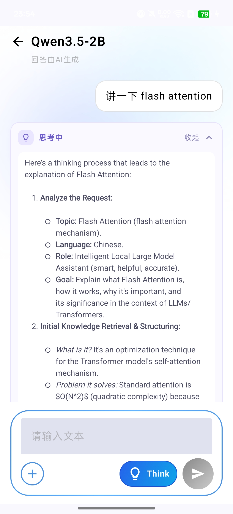

# 聊天使用

## 开始对话

在"我的模型"页面，选择好后端，点击目标模型即可进入聊天界面。顶部显示当前模型名称，输入框位于底部。

## 发送图片



点击输入框左侧的 **+** 按钮可选择图片，支持从相册选取。发送后模型会对图片内容进行分析和描述。

> 图片理解需要模型具备"多模态"能力，例如 Qwen3.5-2B、InternVL 系列。

每条回复下方会显示性能指标：

```
Prefill: 44.42s, 1070 tokens, 24.09 t/s
Decode: 4.18s, 84 tokens, 20.09 t/s
```

- **Prefill**：输入处理阶段的耗时、token 数和速度
- **Decode**：生成阶段的耗时、token 数和速度

## 深度思考模式



支持深度思考的模型（如 Qwen3 系列）会在输入框右侧显示 **Think** 按钮。

- 点击激活（按钮高亮）：模型在回答前先进行完整的推理过程。
- 思考过程以卡片形式展示，可点击"展开"查看完整内容，"收起"隐藏。
- 再次点击 Think 按钮可关闭思考模式，模型将直接输出答案。

深度思考模式适合需要精确推理的问题，如数学题、逻辑分析等，但会增加首次响应时间。

## 历史对话

每次对话会自动保存。通过左侧滑动手势或顶部菜单图标打开历史记录抽屉，点击记录即可继续之前的对话。
