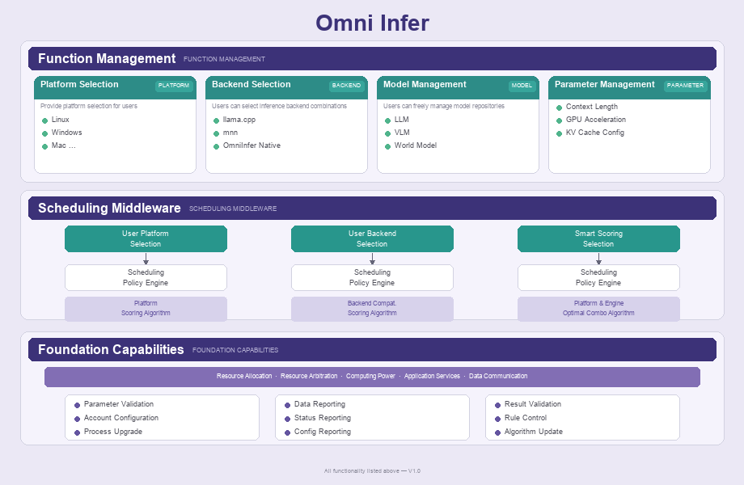

# 引擎与框架

OmniStudio 通过 OmniInfer 的多后端抽象架构支持不同的推理引擎，并由中间调度层根据硬件和模型需求选择更合适的运行后端。

## 当前后端规划

| 后端引擎 | 分支 | 说明 | 状态 |
|---------|------|------|------|
| **llama.cpp** | `main` | 基于 GGML 的推理引擎，社区成熟，兼容 GGUF | 可用 |
| **OmniInfer Native** | `feature/llm-backend` | 自研引擎，面向深度性能优化 | 开发中 |
| **MNN** | — | 阿里巴巴移动端推理框架 | 规划中 |
| **MLX** | — | Apple Silicon 原生推理框架 | 规划中 |
| **ET (ExecuTorch)** | — | Meta 的边缘推理框架 | 规划中 |
| **vLLM** | — | 高吞吐量推理引擎 | 规划中 |

## 文档组织建议

引擎类内容适合在左侧目录中拆成三个层级：

- 引擎与框架概览
- 默认引擎 `llama.cpp`
- 版本更新与健康维护
